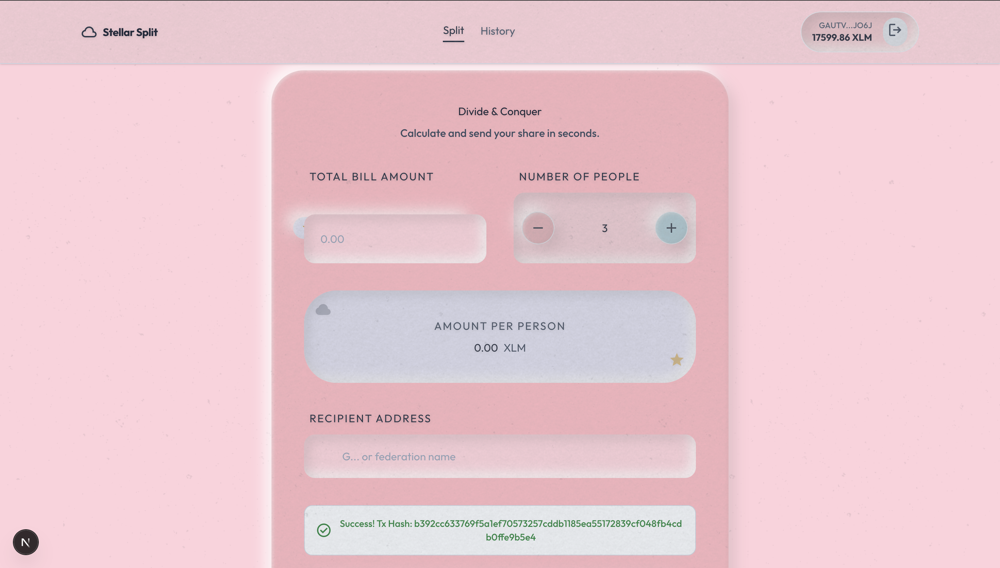
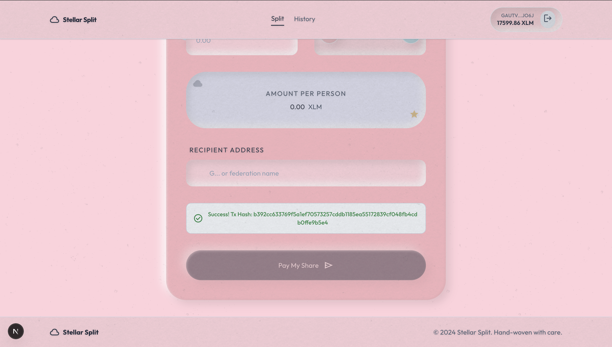
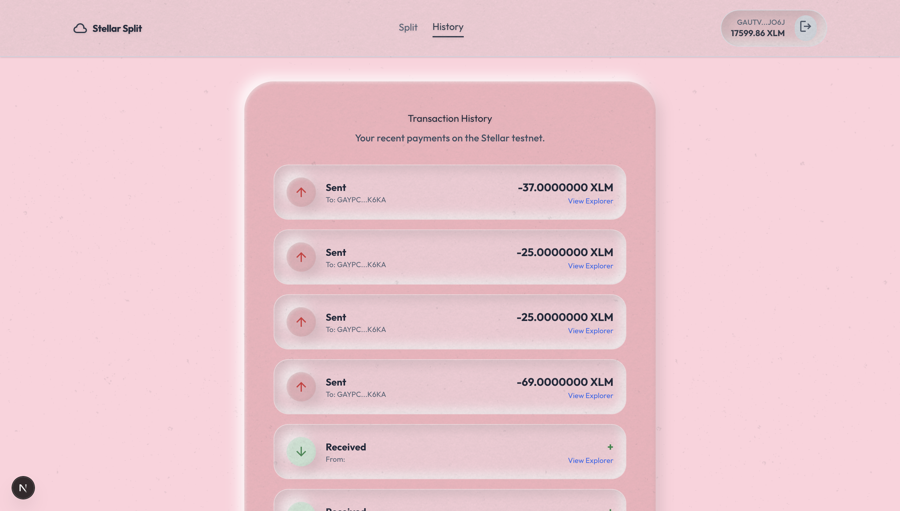
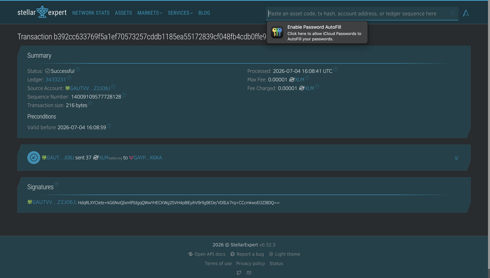

<div align="center">
  
  <h1>☁️ Stellar Split: A Web3 Bill Splitting Calculator</h1>
  <p><strong>A premium, tactile decentralized application built on the Stellar Testnet for fairly dividing expenses.</strong></p>
</div>

---

## 📖 Project Description

Stellar Split is a modern, Web3-native bill-splitting application designed for groups of friends to effortlessly divide their expenses. Leveraging the incredible speed and negligible fees of the Stellar network, this dApp provides a frictionless way to calculate your exact share and immediately settle your debt with a native XLM transfer.

This project was engineered specifically as a submission for the **Stellar Level 1 - White Belt Challenge**, perfectly adhering to all strict development requirements while delivering an exceptional "Cotton Candy" UI/UX design.

---

## ✅ White Belt Requirements Checklist

This project successfully implements all fundamental Stellar development concepts outlined in the Level 1 requirements:

### 1. Wallet Setup
- **Freighter Integration:** Fully supports the Freighter wallet extension as the primary signing mechanism, interacting natively with `@stellar/freighter-api`.
- **Testnet Configured:** The application executes all operations exclusively on the **Stellar Testnet**, completely abstracted from the user.

### 2. Wallet Connection
- **Connect Functionality:** Users can seamlessly connect their wallet via the top app bar using the `@creit.tech/stellar-wallets-kit` modal. The session persists across page reloads using browser local storage.
- **Disconnect Functionality:** Users can cleanly disconnect their session at any time via the wallet pill, instantly wiping local state and resetting the application.

### 3. Balance Handling
- **Fetch Balance:** Queries the Stellar Horizon API in real-time to fetch the connected wallet's exact XLM balance upon connection.
- **Clear Display:** The balance is elegantly rendered inside the pill-shaped top app bar component next to the user's abbreviated public key.

### 4. Transaction Flow
- **Send XLM on Testnet:** Constructs, signs, and successfully executes native XLM payment operations on the Stellar Testnet based on dynamic group-split math (Total Bill / Number of People).
- **Transaction Feedback:** Provides comprehensive user feedback in the main interface, transitioning from "Building transaction..." to "Awaiting signature..." to "Submitting to testnet...".
- **Transaction Result & Confirmation:** Upon success, explicitly outputs the transaction hash along with a success checkmark right beneath the input form. The "History" tab also offers clickable anchor links directly to Stellar Expert.

### 5. Development Standards
- **UI Setup:** Built with Next.js (App Router) and styled using a custom "Cotton Candy" Tailwind CSS system, providing a premium, tactile interface with puffy drop-shadows and subtle felt/grain textures.
- **Wallet Integration & Logic:** Extracted into a reusable React Hook (`hooks/useStellarWallet.ts`) and a dedicated Stellar helper library (`lib/stellar.ts`).
- **Error Handling:** Robust try/catch blocks handle everything from rejected signatures and insufficient funds to missing inputs, surfacing clean, human-readable errors directly in the UI.

---

## 📸 Visual Proof of Concept

Here is a visual demonstration proving all White Belt requirements have been successfully met:

### 1. Wallet Connection & Balance Display
*The wallet is successfully connected. The user's precise XLM balance and abbreviated public key are displayed elegantly in the top right pill. The application automatically calculates the amount per person based on the input.*


### 2. Successful Transaction & User Feedback
*The transaction succeeds on the testnet! The user is presented with a success message containing the exact transaction hash right on the dashboard.*


### 3. Live Transaction History & Explorer Linking
*The History tab queries the Horizon API for recent payments. It displays a ledger of sent and received transactions with clickable verification links.*


### 4. On-Chain Verification
*Clicking the explorer link proves the transaction was successfully settled on the ledger, showcasing the exact fee, source account, and destination.*


---

## 🏗️ Project Structure

The codebase is organized using modern **Next.js 15 App Router** conventions:

```text
split-bill-calculator/
├── app/
│   ├── globals.css         # Global Tailwind and Cotton Candy tactility utilities
│   ├── layout.tsx          # Root layout and font configurations
│   └── page.tsx            # Main application page (Split Card & History Tab)
├── hooks/
│   └── useStellarWallet.ts # React Hook for kit initialization and wallet state
├── lib/
│   └── stellar.ts          # Abstraction layer for Stellar Horizon API SDK interactions
├── demo-img/               # Demonstration screenshots for documentation
└── package.json            # Project dependencies and scripts
```

---

## 🚀 Setup Instructions (Run Locally)

Want to run Stellar Split on your own machine? Follow these simple steps:

### Prerequisites
- Node.js (v18 or higher recommended)
- A browser with the [Freighter Wallet](https://freighter.app/) extension installed.
- Your Freighter wallet must be set to the **Testnet** network.

### 1. Clone the Repository
```bash
git clone https://github.com/bapidas777/Stellar-Split.git
cd split-bill-calculator
```

### 2. Install Dependencies
```bash
npm install
```

### 3. Start the Development Server
```bash
npm run dev
```

### 4. Open the Application
Navigate to [http://localhost:3000](http://localhost:3000) in your browser. 
- Click "Connect Wallet"
- Grab some testnet XLM from the Freighter faucet if your balance is 0.
- Fill out a bill amount, a destination address, and pay your share!

---

## 🛠️ Technology Stack
- **Framework:** Next.js 15 (App Router)
- **Styling:** Tailwind CSS (Custom Tactile Theme)
- **Blockchain SDK:** `@stellar/stellar-sdk`
- **Wallet Integration:** `@creit.tech/stellar-wallets-kit` v2
- **Icons & UI:** Google Material Symbols, Google Fonts (`Outfit`)

---

<div align="center">
  <p>Built with ☁️ on the Stellar Network</p>
</div>
